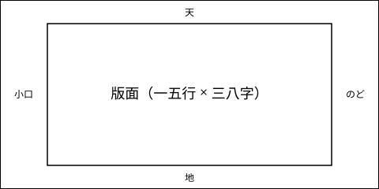

# 第一章　このテンプレートの使い方

　この章では、文庫本テンプレートで原稿を書くときの約束事を説明します。原稿は Markdown で書き、`npm run build` を実行すると A6 判の縦組み PDF ができあがります。

　段落は空行で区切ります。段落の先頭は自動で一字下げになるので、原稿に全角空白を書く必要はありません。この段落のように書いても、なくても、仕上がりは同じです。

「会話文のように、開き括弧で始まる段落は天付きになります」

「これは自動で判定します。原稿で気にすることはありません」

　段落の途中で改行しても、全角文字の間の改行は詰められます。
原稿の一行が長くなりすぎるときは、このように途中で改行して構いません。

## ルビと傍点

　ルビは {漢字|かんじ} のように、波括弧の中を縦棒で区切って書きます。{薔薇|ばら}や{東京|とうきょう}のように、熟語にまとめて振ることもできます。

　傍点は *強調したい語* のように、アスタリスクで挟むと *ゴマ* が付きます。太字は **二重のアスタリスク** で挟みます。

## 縦中横

　二桁までの半角数字は、自動で縦中横になります。午後3時に12人が集まった、と書けば、数字は一字分の枠に横組みで収まります。西暦2026年のように三桁以上の数字は横倒しのまま残るので、漢数字で二〇二六年と書くか、`` で囲んで手動で指定してください。感嘆符と疑問符の組み合わせも、まさか!? のように自動で縦中横になります。

## 行アキと改ページ

　場面の切り替えで一行空けたいときは、行だけの `---` を書きます。

---

　このように一行アキになります。章の見出し（`#` が一つの見出し）は自動で改ページし、四行取りで組まれます。節の見出し（`##`）は二行取りです。

## 注

　注は脚注の記法で書きます[^1]。注の本文は章の終わりにまとめて組まれます。

[^1]: これは注の見本です。注の本文は章末に置かれます。

## 引用と箇条書き

　引用は行頭に `>` を付けます。

> 引用の段落は天から二字下げて組まれます。
> 複数行にわたる引用も、そのまま続けて書けます。

　箇条書きは行頭に `-` を、番号付きの箇条書きは `1.` を付けます。番号は縦中横で組まれます。

- 中黒で始まる項目
- 二つ目の項目

1. 番号で始まる項目
2. 二つ目の項目

## 図

　図を入れるときは通常の画像の記法を使います。図とキャプションは横組みで、版面の幅に収まるよう縮小されます。

　次の章では、実際の小説の文章を組んだ見本を示します。
